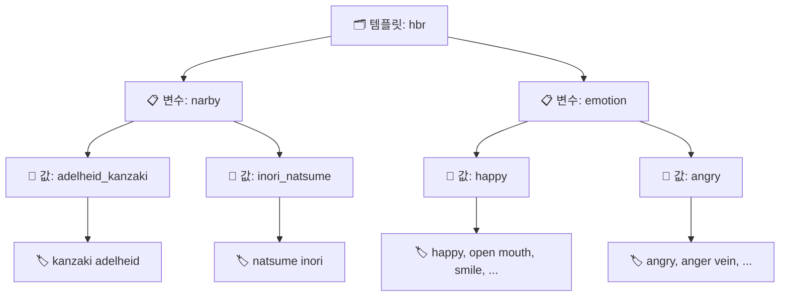
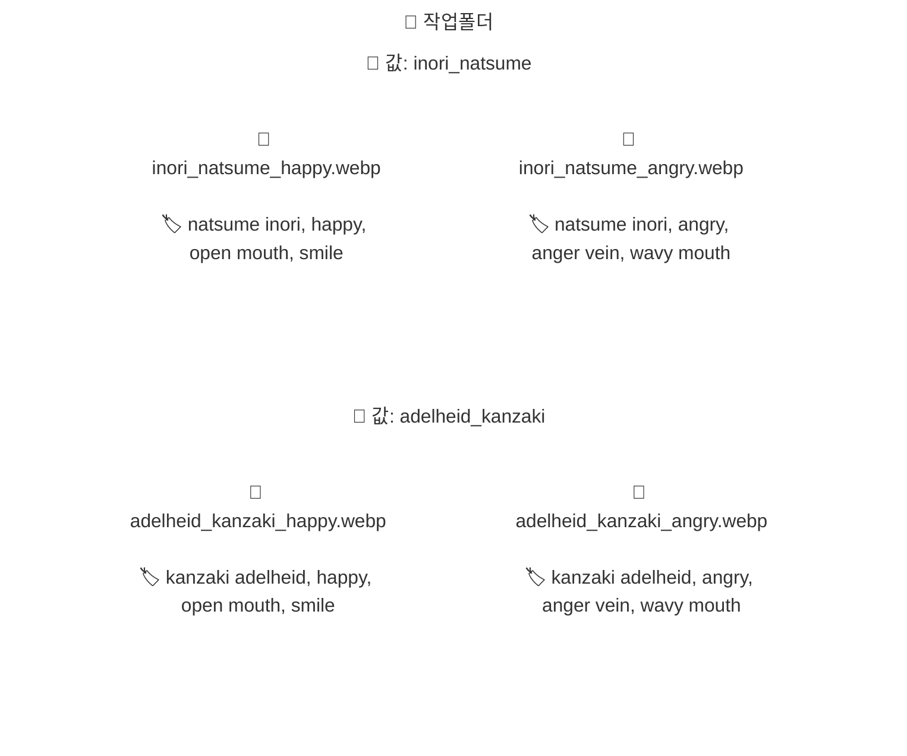

# ExifBasedWorker

NovelAI 이미지에 숨어있는 태그(EXIF/스텔스 메타데이터)를 읽어서,
**파일명을 자동으로 바꾸거나** **폴더로 분류**해 주는 Windows 데스크톱 도구입니다.

## 이런 걸 할 수 있습니다

- 📁 이미지 폴더를 넣으면 태그를 자동으로 읽어 **템플릿** 생성
- 🔍 태그 기반으로 이미지 **검색**
- ✏️ 템플릿에 맞춰 파일명을 **일괄 변경**
- 📂 태그 매칭 결과에 따라 이미지를 **폴더별로 분류(이동)**
- 🖼️ 결과를 썸네일로 미리 확인하고, 상태별로 필터링
- 🔒 실행 전 **드라이런**(미리보기)으로 안전하게 확인 가능

> SDStudio · NAIS2 등의 씬 프리셋 JSON을 통한 템플릿 제작도 지원합니다.

## 설치 및 실행

Windows PowerShell에서 아래 명령을 순서대로 실행하세요.

```powershell
python -m venv venv
.\venv\Scripts\Activate.ps1
python -m pip install -r requirements.txt
python main.py
```

## 사용 흐름


### ① 템플릿 만들기

**템플릿 탭**에서 아래 3가지 방법 중 하나로 만듭니다.

| 방법 | 소스 | 결과 |
|------|------|------|
| **폴더로 생성** | 이미지 폴더 | 파일명 → 값 이름, EXIF 태그 → 값 태그 |
| **JSON으로 생성** (SDStudio) | SDStudio 씬 JSON | 씬 이름 → 값 이름, 프롬프트 → 태그 |
| **JSON으로 생성** (NAIS) | NAIS/NAIS2 씬 JSON | 씬/슬롯 → 값 이름, 프롬프트 → 태그 |


### ② 파일명 변경 / 분류 탭에서 템플릿 선택

- `사용 템플릿`에서 `templates/` 폴더의 JSON 파일을 선택합니다.
- `변수 순서`를 입력합니다. (순서에 따라 출력이 달라집니다)

### ③ 드라이런으로 확인

**드라이런**을 누르면 실제 파일을 변경하지 않고 결과만 미리 볼 수 있습니다.
상태 필터(OK / UNKNOWN / CONFLICT / ERROR)로 필요한 결과만 골라서 확인하세요.

### ④ 실행

결과가 괜찮으면 드라이런을 끄고 실행하면 됩니다.

## 템플릿이란?

이 도구의 모든 작업은 **템플릿**을 기준으로 동작합니다.
템플릿은 "이 태그 조합이 있으면 이 이름을 쓴다"는 규칙의 모음입니다.



아래는 `templates/hbr.json`에서 발췌한 실제 예시입니다.

```json
{
  "name": "default",
  "variables": [
    {
      "name": "emotion",
      "values": [
        {
          "name": "angry",
          "tags": ["angry", "anger vein", "wavy mouth", "open mouth",
                   "hands on own hips", "leaning forward"]
        },
        {
          "name": "happy",
          "tags": ["happy", "open mouth", "smile",
                   "closed eyes", "hand on own stomach", "happy aura"]
        }
      ]
    },
    {
      "name": "narby",
      "values": [
        { "name": "adelheid_kanzaki", "tags": ["kanzaki adelheid"] },
        { "name": "inori_natsume",    "tags": ["natsume inori"] }
      ]
    }
  ]
}
```

**매칭 원리:** 이미지의 태그 목록에 값의 태그가 **전부 포함**되어 있으면 매칭됩니다.

예를 들어, 변수 순서 `narby,emotion`으로 파일명 변경을 실행하면:
- 이미지 태그에 `kanzaki adelheid, happy, open mouth, smile, ...`이 포함 → **🖼️ `adelheid_kanzaki_happy.webp`**
- 이미지 태그에 `natsume inori, angry, anger vein, wavy mouth, ...`이 포함 → **🖼️ `inori_natsume_angry.webp`**
- 태그가 어떤 값과도 매칭되지 않으면 → **UNKNOWN** (건너뜀)
- 태그가 여러 값에 동시에 매칭되면 → **CONFLICT** (건너뜀)

`narby` 기준 분류 결과는 아래처럼 폴더 구조로 생성됩니다.



## 템플릿 검증 규칙

작업 실행 전에 템플릿이 올바른지 자동으로 검사합니다.
규칙에 어긋나면 한국어 에러 메시지와 함께 중단됩니다.

| 대상 | 규칙 | 기호 표현 |
|------|------|----------|
| 변수 이름 | 비어 있으면 안 됨, 템플릿 내 고유 | `변수이름 ≠ ""`, 변수이름 중복 없음 |
| 값 이름 | 비어 있으면 안 됨, 변수 내 고유 | `값이름 ≠ ""`, 같은 변수에서 값이름 중복 없음 |
| 태그 | 값마다 최소 1개 | `태그집합 ≠ ∅` |
| 태그 조합 | 같은 변수 내 동일 조합 금지 | `값1.태그집합 ≠ 값2.태그집합` |
| 태그 부분집합 | 같은 변수 내 포함 관계 금지 | `값1.태그집합 ⊄ 값2.태그집합` |

> `값1`, `값2` = 같은 변수 안의 서로 다른 임의의 값(VariableValue)

## 테스트

```powershell
.\venv\Scripts\python -m pytest tests -v --tb=short
```

> 자동 테스트 대상은 `tests/test_*.py` 파일입니다.

<details>
<summary><b>🧪 테스트 구성 (접기/펼치기)</b></summary>

### 자동 실행 테스트 (pytest 수집 대상)

| 파일 | 용도 |
|------|------|
| `test_build_from_folder.py` | 폴더 기반 변수 생성 서비스 검증 |
| `test_build_from_preset_json.py` | NAIS/SDStudio JSON 기반 변수 생성 검증 |
| `test_extract.py` | 메타/코멘트 payload 추출 로직 검증 |
| `test_gui_services.py` | 검색/파일명 변경/분류 서비스 동작(드라이런 포함) 검증 |
| `test_ipc_emitter.py` | GUI 로그 핸들러(`QueueLogHandler`) 동작 검증 |
| `test_match.py` | 태그 매칭/충돌 상태 판정 검증 |
| `test_normalize.py` | 태그 분리/병합/정규화 로직 검증 |
| `test_scene_preset_import.py` | Scene preset 포맷 import(legacy/SDStudio/NAIS) 검증 |
| `test_schema.py` | Pydantic 스키마 제약(중복/부분집합 등) 검증 |
| `test_tag_sets.py` | 공통 태그 제거/충돌 탐지 유틸 검증 |
| `test_template_ops.py` | 템플릿 에디터 연산(add/update/delete) 검증 |

### 보조 파일 (pytest 자동 수집 대상 아님)

| 파일 | 용도 |
|------|------|
| `_bootstrap.py` | 테스트 실행 시 프로젝트 루트 경로 설정 |
| `conftest.py` | pytest 공통 설정/fixture |
| `__init__.py` | `tests` 패키지 마커 |

</details>

## 배포 (Windows exe 만들기)

PyInstaller로 단독 실행 파일을 만들 수 있습니다.

```powershell
.\venv\Scripts\Activate.ps1
pip install pyinstaller
pyinstaller --noconfirm --windowed --name ExifTemplateTool main.py
```

결과물: `dist/ExifTemplateTool/ExifTemplateTool.exe`

---

<details>
<summary><b>📁 폴더 구조 (개발자용)</b></summary>

```
ExifBased_namer/
├── main.py                    # 앱 진입점
├── core/                      # 핵심 로직 (GUI 독립)
│   ├── adapters/              # 포맷 어댑터 (NAIS/SDStudio/폴더)
│   ├── extract/               # 이미지 메타데이터·태그 추출
│   ├── match/                 # 태그 매칭·분류
│   ├── normalize/             # 태그 정규화
│   ├── preset/                # 템플릿 스키마·입출력
│   ├── runner/                # 작업 실행 (rename/move/search)
│   └── utils/                 # 공통 유틸리티
├── gui/                       # Tkinter GUI
│   ├── app/                   # 앱 본체 (Mixin 분리)
│   ├── template_editor/       # 템플릿 편집기 패널
│   ├── result_panel.py        # 결과·썸네일 패널
│   ├── state.py               # 앱 상태
│   ├── services.py            # 코어 호출 파사드
│   └── services_ops/          # 작업별 서비스 구현
├── nais_builder/              # 호환용 래퍼 (→ core/adapters/)
├── templates/                 # 작업용 템플릿 JSON
├── tests/                     # 자동 테스트
├── logs/                      # 런타임 로그
└── legacy/                    # 이전 프로젝트 보관 (참고 전용)
```

> GUI의 폴더 기반 변수 생성 호출 경로는 `gui/services_ops/build_ops.py`이며,
> 실제 빌드 구현은 `core/adapters/folder_builder.py`입니다.

</details>

## CREDITS

- [NAIS2](https://github.com/sunanakgo/NAIS2) — Scene preset import 포맷 및 SDStudio preset 처리 흐름 참고
