# ExifBasedWorker

NovelAI 이미지에 숨어있는 태그(EXIF/스텔스 메타데이터)를 읽어서,
**파일명을 자동으로 바꾸거나** **폴더로 분류**해 주는 Windows 데스크톱 도구입니다.

## 이런 걸 할 수 있습니다

- 📁 이미지 폴더를 넣으면 태그를 자동으로 읽어 **템플릿** 생성
- 🔍 태그 기반으로 이미지 **검색**
- ✏️ 템플릿에 맞춰 파일명을 **일괄 변경**
- 📂 태그 매칭 결과에 따라 이미지를 **폴더별로 분류(이동)**
- 🖼️ 결과를 썸네일로 미리 확인하고, 상태별로 필터링
- 🔒 실행 전 **드라이런**(미리보기)으로 안전하게 확인 가능

> SDStudio · NAIS2 등의 씬 프리셋 JSON을 통한 템플릿 제작도 지원합니다.

## 설치 및 실행

Windows PowerShell에서 아래 명령을 순서대로 실행하세요.

```powershell
python -m venv venv
.\venv\Scripts\Activate.ps1
python -m pip install -r requirements.txt
python main.py
```

## 사용 흐름


### ① 템플릿 만들기

**템플릿 탭**에서 아래 3가지 방법 중 하나로 만듭니다.

| 방법 | 소스 | 결과 |
|------|------|------|
| **폴더로 생성** | 이미지 폴더 | 파일명 → 값 이름, EXIF 태그 → 값 태그 |
| **JSON으로 생성** (SDStudio) | SDStudio 씬 JSON | 씬 이름 → 값 이름, 프롬프트 → 태그 |
| **JSON으로 생성** (NAIS) | NAIS/NAIS2 씬 JSON | 씬/슬롯 → 값 이름, 프롬프트 → 태그 |

**유효성 검증** 버튼으로 이름 중복·태그 누락·태그 충돌 등을 사전에 검사할 수 있습니다. 자세한 규칙은 [템플릿 검증 규칙](#템플릿-검증-규칙)을 참고하세요.


### ② 파일명 변경 / 분류 탭에서 템플릿 선택

- `사용 템플릿`에서 `templates/` 폴더의 JSON 파일을 선택합니다.
- `변수 순서`를 입력합니다. (순서에 따라 출력이 달라집니다)

### ③ 드라이런으로 확인

**드라이런**을 켜고 실행하면 파일을 실제로 건드리지 않고 "이렇게 될 예정" 결과만 보여줍니다.
각 이미지마다 아래 상태 중 하나가 표시되며, 상태별로 필터링해서 볼 수 있습니다.

| 상태 | 의미 |
|------|------|
| **OK** | 매칭 성공, 정상 처리 대상 |
| **UNKNOWN** | 어떤 값과도 매칭되지 않음 (건너뜀) |
| **CONFLICT** | 여러 값에 동시에 매칭됨 (건너뜀) |
| **ERROR** | 파일 읽기 실패 등 예외 발생 |

### ④ 실행

결과가 괜찮으면 드라이런을 끄고 실행하면 됩니다.

## 템플릿이란?

이 도구의 모든 작업은 **템플릿**을 기준으로 동작합니다.
템플릿은 "이 태그 조합이 있으면 이 이름을 쓴다"는 규칙의 모음입니다.

### 구조

```
템플릿
├── 변수: chara
│   ├── 값: adelheid_kanzaki  →  태그: [kanzaki_adelheid]
│   └── 값: inori_natsume     →  태그: [natsume_inori]
└── 변수: emotion
    ├── 값: happy     →  태그: [happy, open mouth, smile, ...]
    └── 값: angry     →  태그: [angry, anger vein, ...]
```

이미지의 메타데이터에서 추출한 태그가 값의 태그에 **전부 포함**되면 매칭됩니다.

### 파일명 변경 규칙

변수 순서를 지정하면, 매칭된 값 이름을 순서대로 조합해서 파일명을 만듭니다.

**일반 패턴:** 변수 순서 `변수1,변수2`일 때 → `[변수1의 값]_[변수2의 값].확장자`

**예시:** 변수 순서 `chara,emotion`일 때:

| 이미지에 포함된 태그 | 매칭 결과 | 파일명 |
|---------------------|----------|--------|
| kanzaki adelheid, happy, open mouth, smile, ... | chara=adelheid_kanzaki, emotion=happy | `adelheid_kanzaki_happy.webp` |
| natsume inori, angry, anger vein, ... | chara=inori_natsume, emotion=angry | `inori_natsume_angry.webp` |
| (어떤 값과도 매칭 안 됨) | — | UNKNOWN (건너뜀) |
| (여러 값에 동시 매칭) | — | CONFLICT (건너뜀) |

`chara` 기준 분류 결과는 아래처럼 폴더 구조로 생성됩니다.

```mermaid
flowchart TB
    subgraph ROOT["📁 작업폴더"]
        direction LR
        subgraph N1["📌 값: adelheid_kanzaki"]
            F1["📄 adelheid_kanzaki_happy.webp<br/><br/>🏷️ kanzaki adelheid, happy, open mouth, smile"]
            F2["📄 adelheid_kanzaki_angry.webp<br/><br/>🏷️ kanzaki adelheid, angry, anger vein, wavy mouth"]
        end

        subgraph N2["📌 값: inori_natsume"]
            F3["📄 inori_natsume_happy.webp<br/><br/>🏷️ natsume inori, happy, open mouth, smile"]
            F4["📄 inori_natsume_angry.webp<br/><br/>🏷️ natsume inori, angry, anger vein, wavy mouth"]
        end
    end

    style ROOT fill:transparent,stroke:#ffffff,stroke-width:2px
    style N1 fill:transparent,stroke:#ffffff,stroke-width:2px
    style N2 fill:transparent,stroke:#ffffff,stroke-width:2px
    style F1 fill:transparent,stroke:#ffffff,stroke-width:1px
    style F2 fill:transparent,stroke:#ffffff,stroke-width:1px
    style F3 fill:transparent,stroke:#ffffff,stroke-width:1px
    style F4 fill:transparent,stroke:#ffffff,stroke-width:1px
```



## 템플릿 검증 규칙

템플릿에 문제가 있으면 작업 실행 시 매칭이 엉키거나, 결과를 예측할 수 없습니다.
**유효성 검증** 버튼을 누르면 아래 규칙을 검사하며, 작업(파일명 변경·분류) 실행 시에도 자동으로 검증됩니다. 위반 시 한국어 에러 메시지가 표시됩니다.

| 대상 | 규칙 | 기호 표현 |
|------|------|----------|
| 변수 이름 | 비어 있으면 안 됨, 템플릿 내 고유 | `변수이름 ≠ ""`, 변수이름 중복 없음 |
| 값 이름 | 비어 있으면 안 됨, 변수 내 고유 | `값이름 ≠ ""`, 같은 변수에서 값이름 중복 없음 |
| 태그 | 값마다 최소 1개 | `태그집합 ≠ ∅` |
| 태그 조합 | 같은 변수 내 동일 조합 금지 | `값1.태그집합 ≠ 값2.태그집합` |
| 태그 부분집합 | 같은 변수 내 포함 관계 금지 | `값1.태그집합 ⊄ 값2.태그집합` |

> `값1`, `값2` = 같은 변수 안의 서로 다른 임의의 값

**부분집합 금지가 필요한 이유:** `happy_1`의 태그가 `{smile, open mouth}`이고 `happy_2`의 태그가 `{smile, open mouth, blush}`라면, `smile, open mouth, blush`가 있는 이미지는 두 값에 동시에 매칭되어 CONFLICT가 됩니다. 이런 상황을 템플릿 단계에서 미리 막아 줍니다.

## 테스트

```powershell
.\venv\Scripts\python -m pytest tests -v --tb=short
```

> 자동 테스트 대상은 `tests/**/test_*.py` 파일입니다.

<details>
<summary><b>🧪 테스트 구성 (접기/펼치기)</b></summary>

### 자동 실행 테스트 (pytest 수집 대상)

| 파일 | 용도 |
|------|------|
| `tests/core/test_extract.py` | 메타/코멘트 payload 추출 로직 검증 |
| `tests/core/test_match.py` | 태그 매칭/충돌 상태 판정 검증 |
| `tests/core/test_normalize.py` | 태그 분리/병합/정규화 로직 검증 |
| `tests/core/test_schema.py` | Pydantic 스키마 제약(중복/부분집합 등) 검증 |
| `tests/core/test_tag_sets.py` | 공통 태그 제거/충돌 탐지 유틸 검증 |
| `tests/gui/test_gui_services.py` | 검색/파일명 변경/분류 서비스 동작(드라이런 포함) 검증 |
| `tests/gui/test_ipc_emitter.py` | GUI 로그 핸들러(`QueueLogHandler`) 동작 검증 |
| `tests/preset/test_build_from_folder.py` | 폴더 기반 변수 생성 서비스 검증 |
| `tests/preset/test_build_from_preset_json.py` | NAIS/SDStudio JSON 기반 변수 생성 검증 |
| `tests/preset/test_scene_preset_import.py` | Scene preset 포맷 import(legacy/SDStudio/NAIS) 검증 |
| `tests/templates/test_template_bulk_add_mode.py` | 값 이름 일괄 문자열 추가 모드(앞/뒤) 처리 검증 |
| `tests/templates/test_template_generation_apply.py` | 변수 생성 적용 시 동일 변수명 충돌 처리(사유 알림 후 미적용) 검증 |
| `tests/templates/test_template_load_modes.py` | 템플릿 불러오기 모드(초기화/변수 추가) 및 충돌 시 미적용 검증 |
| `tests/templates/test_template_ops.py` | 템플릿 에디터 연산(add/update/delete) 검증 |

### 수동 검증 도구

| 파일 | 용도 |
|------|------|
| `tools/hash_verification/compare_by_fingerprint_ui.py` | 해시 기반 파일명 복구 검증 UI (`.\venv\Scripts\python tools\hash_verification\compare_by_fingerprint_ui.py`) |
| `tools/filename_tag_tool/filename_value_extractor_gui.py` | 파일명 정규식 추출/상태 필터/이미지 뷰어/값 기반 태그 생성(일괄 정규식 치환·개별 수정) GUI (`.\venv\Scripts\python tools\filename_tag_tool\filename_value_extractor_gui.py`) |

### 보조 파일 (pytest 자동 수집 대상 아님)

| 파일 | 용도 |
|------|------|
| `pytest.ini` | pytest 기본 수집 경로(`tests`) 및 루트 pythonpath 설정 |
| `conftest.py` | pytest 공통 설정/fixture |
| `__init__.py` | `tests` 패키지 마커 |

</details>

---

<details>
<summary><b>📁 폴더 구조 </b></summary>

```
ExifBased_namer/
├── main.py                    # 앱 진입점
├── core/                      # 핵심 로직 (GUI 독립)
│   ├── adapters/              # 포맷 어댑터 (NAIS/SDStudio/폴더)
│   ├── extract/               # 이미지 메타데이터·태그 추출
│   ├── match/                 # 태그 매칭·분류
│   ├── normalize/             # 태그 정규화
│   ├── preset/                # 템플릿 스키마·입출력
│   ├── runner/                # 작업 실행 (rename/move/search)
│   └── utils/                 # 공통 유틸리티
├── gui/                       # Tkinter GUI
│   ├── app/                   # 앱 본체 (Mixin 분리)
│   ├── template_editor/       # 템플릿 편집기 패널
│   ├── result_panel.py        # 결과·썸네일 패널
│   ├── state.py               # 앱 상태
│   ├── services.py            # 코어 호출 파사드
│   └── services_ops/          # 작업별 서비스 구현
├── tools/                     # 수동 검증/보조 도구
│   ├── filename_tag_tool/     # 파일명 추출/태그 생성 GUI 도구
│   └── hash_verification/     # 해시 기반 비교 검증 도구
├── templates/                 # 작업용 템플릿 JSON
├── tests/                     # 자동 테스트
│   ├── core/
│   ├── gui/
│   ├── preset/
│   └── templates/
├── logs/                      # 런타임 로그
└── pytest.ini                 # pytest 설정
```

> GUI의 폴더 기반 변수 생성 호출 경로는 `gui/services_ops/build_ops.py`이며,
> 실제 빌드 구현은 `core/adapters/folder_builder.py`입니다.

</details>

## CREDITS

- [NAIS2](https://github.com/sunanakgo/NAIS2) — Scene preset import 포맷 및 SDStudio preset 처리 흐름 참고
